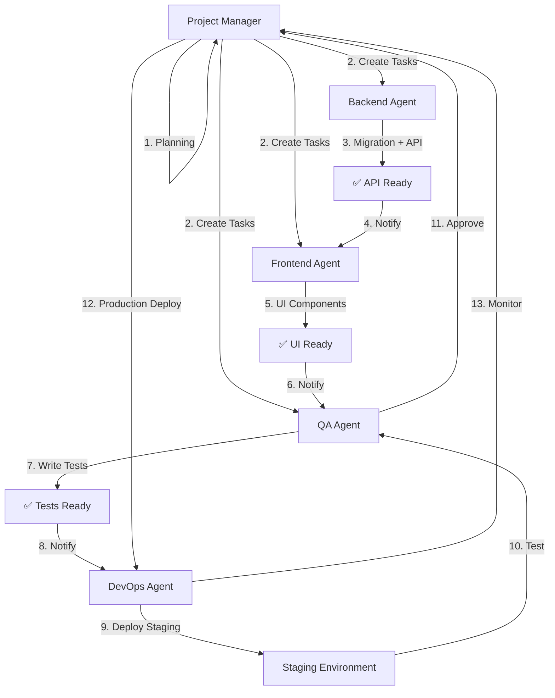

# Purriosity - Agent-Übersicht & Zusammenarbeit

## 🤖 Die 6 Agenten

### 1. Project Manager Agent 🎯
**Rolle**: Orchestrator & Quality Guardian

**Verantwortlichkeiten**:
- Koordiniert alle anderen Agenten
- Code Reviews & Quality Gates
- Performance-Optimierung
- Architektur-Konsistenz
- Incident Management

**Custom Instructions**: [agent_project_manager.md](file:///Users/george/.gemini/antigravity/brain/d1e66506-f165-46bb-9a26-b850b4a18701/agent_project_manager.md)

---

### 2. Frontend Agent 💻
**Rolle**: UI/UX Implementation

**Verantwortlichkeiten**:
- Next.js, React, Tailwind, DaisyUI
- Masonry Grid, Product Cards
- Purr/Save Buttons & Animations
- Responsive Design
- Accessibility

**Custom Instructions**: [agent_frontend.md](file:///Users/george/.gemini/antigravity/brain/d1e66506-f165-46bb-9a26-b850b4a18701/agent_frontend.md)

---

### 3. Backend Agent 🗄️
**Rolle**: Database & API Development

**Verantwortlichkeiten**:
- Supabase (PostgreSQL)
- Database Schema & Migrations
- Row Level Security (RLS)
- Edge Functions
- API Endpoints

**Custom Instructions**: [agent_backend.md](file:///Users/george/.gemini/antigravity/brain/d1e66506-f165-46bb-9a26-b850b4a18701/agent_backend.md)

---

### 4. Content Agent 📝
**Rolle**: Content Creation & Curation

**Verantwortlichkeiten**:
- Produkt-Kuratierung
- Blog-Artikel schreiben
- SEO-Optimierung
- Pinterest-Strategie
- Tag-Management

**Custom Instructions**: [agent_content.md](file:///Users/george/.gemini/antigravity/brain/d1e66506-f165-46bb-9a26-b850b4a18701/agent_content.md)

---

### 5. DevOps Agent 🚀
**Rolle**: Deployment & Infrastructure

**Verantwortlichkeiten**:
- CI/CD Pipeline (GitHub Actions)
- Vercel Deployment
- Monitoring (Sentry, UptimeRobot)
- Environment Management
- Backup & Recovery

**Custom Instructions**: [agent_devops.md](file:///Users/george/.gemini/antigravity/brain/d1e66506-f165-46bb-9a26-b850b4a18701/agent_devops.md)

---

### 6. QA Agent ✅
**Rolle**: Quality Assurance & Testing

**Verantwortlichkeiten**:
- E2E Tests (Playwright)
- Accessibility Audits
- Performance Testing (Lighthouse)
- Cross-Browser Testing
- Bug Tracking

**Custom Instructions**: [agent_qa.md](file:///Users/george/.gemini/antigravity/brain/d1e66506-f165-46bb-9a26-b850b4a18701/agent_qa.md)

---

## 🔄 Agent-Interaktionen

### Workflow-Beispiel: Neues Feature "Public Collections"



---

## 📋 Typische Workflows

### 1. Bug Fix Workflow

```
User Report → PM Agent
    ↓
PM: Severity bestimmen (P0-P3)
    ↓
PM → Betroffener Agent (Frontend/Backend)
    ↓
Agent: Fix implementieren
    ↓
QA Agent: Testen
    ↓
DevOps Agent: Deploy
    ↓
PM: Verify & Close
```

### 2. Content Creation Workflow

```
Content Agent: Produkt recherchieren
    ↓
Content Agent: Beschreibung schreiben
    ↓
Content Agent: Tags vergeben
    ↓
Backend Agent: Produkt in DB einfügen
    ↓
Frontend Agent: Im Grid anzeigen
    ↓
QA Agent: Visual Check
    ↓
PM: Approve & Publish
```

### 3. Performance Optimization Workflow

```
PM: Performance-Issue identifiziert
    ↓
PM: Bottleneck analysieren
    ↓
PM → Betroffener Agent
    ↓
Frontend: Code Splitting / Lazy Loading
    oder
Backend: Query Optimization / Indexing
    ↓
QA: Performance-Test (Lighthouse)
    ↓
PM: Vorher/Nachher Vergleich
    ↓
DevOps: Deploy
```

---

## 🤝 Kommunikations-Protokoll

### Daily Standup (Async)

**Format**:
```
Agent: [Name]
Yesterday: [Was wurde gemacht]
Today: [Was wird gemacht]
Blockers: [Gibt es Hindernisse?]
```

**Beispiel**:
```
Agent: Frontend
Yesterday: Product Grid implementiert
Today: Purr-Animation & Save-Button
Blockers: Brauche API-Endpoint für /purrs

Agent: Backend
Yesterday: Database Schema erstellt
Today: RLS Policies & API-Endpoints
Blockers: Keine

Agent: QA
Yesterday: E2E-Tests für Login
Today: E2E-Tests für Purr-Flow
Blockers: Warte auf Frontend-Completion
```

---

### Code Review Prozess

**1. Agent erstellt PR**:
```
Title: feat: Add Purr Button Animation
Description: 
- Implementiert Purr-Animation mit Framer Motion
- Fügt Particle-Effekt hinzu
- Optimiert Performance (useMemo)

Checklist:
- [x] ESLint passing
- [x] TypeScript strict
- [x] Tests geschrieben
- [x] Accessibility geprüft
```

**2. PM Agent reviewt**:
```
Comments:
🟢 Nice to Have: Könnten wir die Animation-Duration 
   konfigurierbar machen?
   
🟡 Should Fix: Particle-Komponente sollte lazy loaded werden
   (Bundle Size Optimierung)
   
✅ Approved (nach Fixes)
```

**3. Agent addressed Feedback**:
```
- ✅ Animation-Duration als Prop
- ✅ Lazy Loading für Particles
- ✅ Bundle Size: -15KB
```

**4. PM merges PR**

---

## 🎯 Verantwortlichkeits-Matrix (RACI)

| Task | PM | FE | BE | Content | DevOps | QA |
|------|----|----|----|---------|----|-----|
| **Feature Planning** | R | C | C | C | I | I |
| **UI Implementation** | A | R | I | I | I | C |
| **API Development** | A | C | R | I | I | C |
| **Database Schema** | A | I | R | I | I | I |
| **Content Creation** | A | I | I | R | I | C |
| **Blog Writing** | A | I | I | R | I | C |
| **Deployment** | A | I | I | I | R | C |
| **Testing** | A | C | C | I | I | R |
| **Performance Opt** | R | C | C | I | C | C |
| **Code Review** | R | C | C | C | C | C |

**Legende**:
- **R** = Responsible (führt aus)
- **A** = Accountable (verantwortlich)
- **C** = Consulted (wird konsultiert)
- **I** = Informed (wird informiert)

---

## 🛠️ Tools & Plattformen

### Shared Tools (alle Agenten)

- **GitHub**: Code Repository, Issues, PRs
- **Slack**: Daily Communication
- **Figma**: Design Reference
- **Notion/Docs**: Documentation

### Agent-Specific Tools

**Frontend**:
- VS Code, ESLint, Prettier
- Storybook (Component Library)
- React DevTools

**Backend**:
- Supabase Dashboard
- pgAdmin / Postico
- Postman (API Testing)

**Content**:
- Canva (Pinterest Pins)
- Ahrefs / SEMrush (SEO)
- Grammarly (Proofreading)

**DevOps**:
- Vercel Dashboard
- Sentry
- UptimeRobot

**QA**:
- Playwright
- Lighthouse CI
- BrowserStack

**PM**:
- GitHub Projects (Kanban)
- Analytics Dashboards
- Reporting Tools

---

## 📊 Success Metrics (Team-Level)

| Metrik | Zielwert | Owner |
|--------|----------|-------|
| **Sprint Velocity** | 20 Story Points | PM |
| **Code Quality** | Lighthouse > 90 | PM + Frontend |
| **API Performance** | < 200ms (p95) | Backend |
| **Uptime** | > 99.9% | DevOps |
| **Bug Rate** | < 5/Sprint | QA |
| **Content Output** | 10 Products/Week | Content |
| **SEO Traffic** | +20%/Monat | Content |

---

## 🚀 Onboarding neuer Agenten

**Wenn ein neuer Agent hinzukommt**:

1. **PM Agent**: Onboarding-Session
   - Projekt-Übersicht
   - Architektur-Walkthrough
   - Custom Instructions durchgehen

2. **Setup**:
   - GitHub Access
   - Slack Channel
   - Tool Access (Supabase, Vercel, etc.)

3. **First Task**:
   - Kleine, überschaubare Aufgabe
   - Paired Programming mit erfahrenem Agent
   - Code Review durch PM

4. **Feedback**:
   - Nach 1 Woche: Check-in
   - Nach 1 Monat: Retrospektive

---

## ✅ Zusammenfassung

**6 Agenten, 1 Ziel: Purriosity zum Erfolg führen**

- **PM Agent**: Der Dirigent, koordiniert alle
- **Frontend Agent**: Baut die UI
- **Backend Agent**: Baut die API & DB
- **Content Agent**: Füllt die Plattform mit Leben
- **DevOps Agent**: Hält alles am Laufen
- **QA Agent**: Stellt Qualität sicher

**Erfolg durch Zusammenarbeit** 🤝
